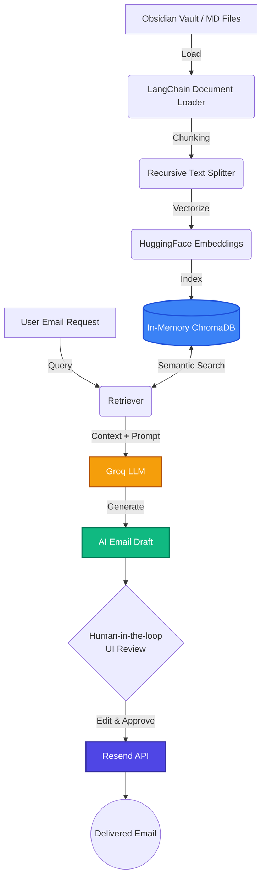

# VaultMail AI ✉️🤖

**VaultMail AI** is an intelligent, RAG-powered email assistant designed to seamlessly integrate with your personal knowledge base (like an Obsidian Vault) to generate highly contextual and accurate email drafts.

Built as a production-quality MVP, it demonstrates advanced capabilities in **Retrieval-Augmented Generation (RAG)**, large language model orchestration, and Agentic AI workflows with strict "human-in-the-loop" approval processes.

---

## 🏗️ System Architecture & Workflow

The system is built on a modular, secure, and ephemeral pipeline to ensure user data remains safe while generating highly grounded responses.



### Architecture Breakdown:
1. **Data Ingestion**: Parses `.zip` archives of Obsidian vaults directly in-memory or reads from a temporary generated Demo Vault.
2. **Document Chunking**: Splits large markdown files into semantic chunks using `RecursiveCharacterTextSplitter`.
3. **Embedding & Storage**: Uses lightweight open-source embeddings (`all-MiniLM-L6-v2`) and indexes them in a rapid **in-memory ChromaDB** to prevent state-leakage and read-only filesystem errors during cloud deployment.
4. **Retrieval (RAG)**: When a user prompts for an email, the system retrieves the Top-K most relevant chunks from the vault.
5. **Generation**: The retrieved context and user prompt are fed into a **Groq-hosted LLM** (e.g., Llama 3 / Gemma / Compound) for lightning-fast text generation.
6. **Human-in-the-loop**: The AI does *not* send emails blindly. The draft is surfaced in the Streamlit UI for user review, editing, and final approval.
7. **Dispatch**: Approved emails are dispatched programmatically using the **Resend API**.

---

## 🌟 Key Features

- **Strict Data Grounding**: AI generates responses strictly based on the provided knowledge base, preventing hallucinations.
- **Privacy-First Memory**: Employs an ephemeral (in-memory) vector database. Your data is destroyed when the session ends.
- **Cross-Platform Compatibility**: Fully functional on Windows, Linux, and Streamlit Community Cloud.
- **Blazing Fast**: Uses Groq's LPU inference engine for near-instant email generation.
- **Polished UI**: Clean, responsive frontend built with Streamlit.

---

## 💻 Tech Stack

- **Frontend / UI**: Streamlit
- **LLM Provider**: Groq API
- **RAG & Orchestration**: LangChain (`langchain-core`, `langchain-groq`)
- **Embeddings**: HuggingFace (`sentence-transformers`)
- **Vector Database**: ChromaDB (`langchain-chroma`)
- **Email Dispatch**: Resend

---

## 🚀 Getting Started

### Prerequisites
- Python 3.9 to 3.13
- Git
- API Keys:
  - [Groq API Key](https://console.groq.com/) (For LLM)
  - [Resend API Key](https://resend.com/) (For email dispatch)

### 1. Clone & Setup Environment
```bash
git clone https://github.com/YOUR_USERNAME/VaultMail-AI.git
cd VaultMail-AI

# Create virtual environment
python -m venv .venv

# Activate environment (Windows)
.venv\Scripts\activate

# Activate environment (Mac/Linux)
source .venv/bin/activate

# Install strictly required dependencies
pip install -r requirements.txt
```

### 2. Configure Secrets
Create a `.env` file in the root directory and add your keys:
```env
GROQ_API_KEY=your_groq_api_key_here
GROQ_MODEL=groq/compound-mini
RESEND_API_KEY=your_resend_api_key_here
RESEND_FROM_EMAIL=onboarding@resend.dev
DEMO_MODE=false
```

### 3. Run the Application
```bash
streamlit run app.py
```

---

## 📂 Project Structure

```text
VaultMail-AI/
│
├── app.py                   # Main Streamlit Application UI
├── requirements.txt         # Cleaned Python dependencies
├── .env                     # Environment variables (Ignored by Git)
│
├── src/                     # Core Business Logic
│   ├── chunker.py           # Markdown text splitting logic
│   ├── config.py            # Environment variable loading
│   ├── email_generator.py   # LangChain LLM prompting & generation
│   ├── email_sender.py      # Resend API integration
│   ├── embeddings.py        # HuggingFace embedding initialization
│   ├── retriever.py         # Semantic search and context retrieval
│   ├── vault_loader.py      # Safe Temp-directory Vault Extraction
│   └── vector_store.py      # In-Memory ChromaDB configuration
│
└── tests/                   # Pytest automated test suite
```

---
*Developed as an AI Internship MVP to demonstrate applied Agentic workflows and RAG systems.*
